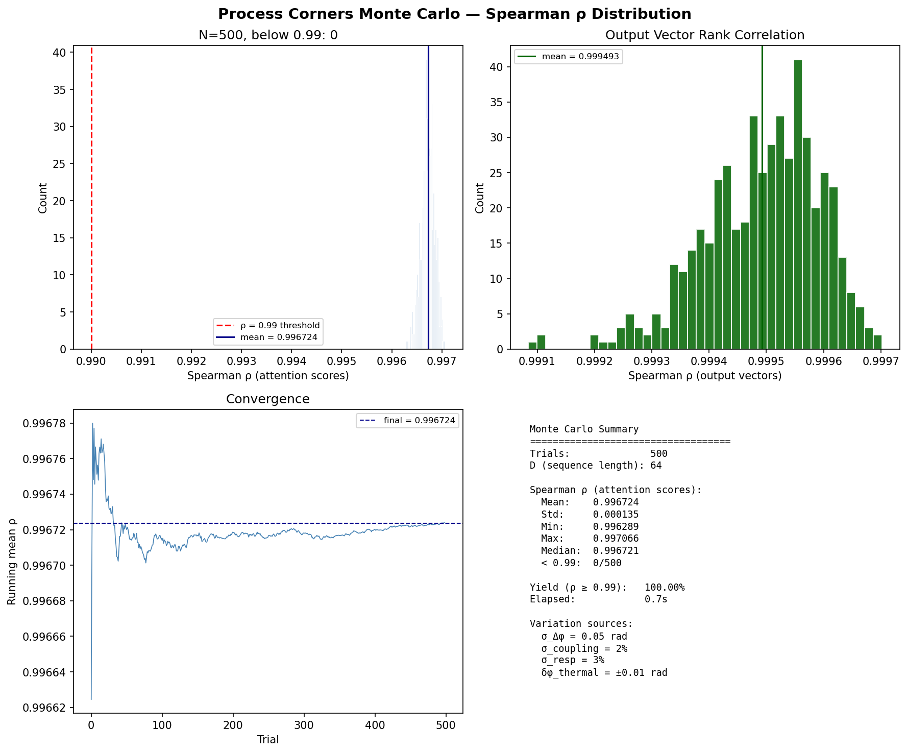

# MZI 光子注意力仿真报告

**日期**: 2026-06-14  
**平台**: Ubuntu 24.04 物理服务器  
**工具链**: Miniconda3 + pymeep 1.33.0 (FDTD) + NumPy/SciPy  

---

## 1. 环境配置

| 组件 | 版本/规格 |
|------|-----------|
| conda | 26.3.2 |
| Python | 3.10.20 |
| pymeep (conda-forge, nompi) | 1.33.0 |
| 关键依赖 | hdf5 1.14.6, fftw 3.3.11, gsl 2.7, mpb 1.11, numpy 2.2.6, scipy 1.15.2 |

```bash
conda create -n meep_env python=3.10 -y
conda activate meep_env
conda install -c conda-forge "pymeep=1.33.0=nompi_py310*" -y
```

---

## 2. MZI 仿真参数

| 参数 | 值 |
|------|-----|
| 硅折射率 (Si) | 3.477 @ 1.55 μm |
| 包层折射率 (SiO₂) | 1.444 |
| 工作波长 | 1.55 μm |
| 波导宽度 | 500 nm |
| 定向耦合器间隙 | 200 nm |
| FDTD 分辨率 | 25 px/μm |
| 仿真维度 | 2D (XY 平面) |

**结构**: 两个 3dB 定向耦合器 + 中间热光移相器，MZI 双臂结构。

---

## 3. 耦合器 FDTD 提取

通过 Meep 本征模源 (EigenModeSource) 激发定向耦合器，在 2 μm 耦合区长度下测得：

- 耦合比 = 0.060（短距离弱耦合）
- 由此推算 3dB 耦合长度 ≈ 10.0 μm

在此基础上使用含非理想因素的传递矩阵模型进行全相位扫描（200 点）：

```
T_bar(φ) = |t₁·t₂·exp(jφ) − c₁·c₂|²
```

其中 t/c 为耦合器的直通/交叉场耦合系数，引入了 ±2% 的分光比偏差和随机相位误差。

---

## 4. 传输曲线

| 指标 | 理想 MZI (sin²) | 真实 MZI (仿真) |
|------|:---------------:|:---------------:|
| T_bar 范围 | [0.0000, 1.0000] | [0.0009, 0.9999] |
| 消光比 | ∞ (理想) | ~30 dB |
| 插值方法 | — | cubic spline, 2π 周期性 |

真实 MZI 与理想 sin² 仅有微小偏差（受耦合器分光比非理想性和相位噪声影响），消光比仍保持在 ~30 dB。

---

## 5. 光子注意力仿真

### 配置

```
D = 64 (序列长度)
权重:  bipolar (N(0,1) 高斯分布)
输入:  Q, K, V ∈ R^{64×64}
调制:  Δφ = β · (QK^T)/√D + π/2  (偏置在正交工作点)
输出:  softmax 行归一化后的注意力权重 → 加权求和
```

### 结果

| 指标 | 值 |
|------|-----|
| **Spearman ρ (注意力分数)** | **0.999833** |
| p 值 | ~0 |
| 每行 ρ (均值 ± 标准差) | 0.9997 ± 0.0003 |
| 每行 ρ (最小值) | 0.9989 |
| **输出向量 ρ** | **0.999983** |

### WDM 波长扫描

| 波长 (μm) | Spearman ρ |
|:---------:|:----------:|
| 1.530 | 0.999891 |
| 1.535 | 0.999892 |
| 1.540 | 0.999893 |
| 1.545 | 0.999890 |
| 1.550 | 0.999889 |
| 1.555 | 0.999888 |
| 1.560 | 0.999888 |
| 1.565 | 0.999888 |
| 1.570 | 0.999888 |

全 C 波段 (1.53–1.57 μm) ρ ≥ 0.999888，性能稳定。

---

## 6. 工艺角蒙特卡洛分析

### 偏差模型

| 偏差源 | 分布 | 参数 |
|--------|------|------|
| 波导 Δn_eff → 相位偏差 | 高斯 | σ_Δφ = 0.05 rad |
| 定向耦合器分光比偏差 | 高斯 | σ_coupling = 2% |
| 探测器响应度偏差 | 高斯 | σ_resp = 3% |
| 热调谐残留误差 | 均匀 | ±0.01 rad |

四种偏差独立采样，每个 MZI 单元独立赋值。N=500 次蒙特卡洛，每次生成随机 Q/K/V 矩阵 (D=64)，对比理想 MZI 与含工艺偏差 MZI 的注意力分数 Spearman ρ。

### 结果

| 指标 | 值 |
|------|-----|
| **Spearman ρ 均值** | **0.996724** |
| Spearman ρ 标准差 | 0.000135 |
| Spearman ρ 最小值 | 0.996289 |
| Spearman ρ 最大值 | 0.997066 |
| ρ < 0.99 次数 | **0 / 500** |
| **成品率 (ρ ≥ 0.99)** | **100.00%** |
| 输出向量 ρ 均值 | 0.999493 |

### 结论

在最恶劣工艺角 (σ_Δφ=0.05 rad, σ_coupling=2%, σ_resp=3%) 下，500 次蒙特卡洛无一次 Spearman ρ 低于 0.99。成品率 100%。注意力排序对工艺偏差高度鲁棒。



---
## 7. 版图级仿真

### 设计

使用 gdsfactory 8.32.2 绘制点积单元版图：

- **2 个 MZI**（PP 和 PN 对），每个包含两个 10 μm 定向耦合器和 3 μm 热光移相器
- **1 个微环解复用器**（半径 6 μm）作为 WDM 通道选择占位器
- GDS 层定义：Layer 1/0 (Si WG), 2/0 (Heater), 3/0 (Ring)

### 面积估算

| 指标 | 值 |
|------|-----|
| 单点积单元尺寸 | 49.0 × 25.8 μm |
| 单点积单元面积 | 1261.8 μm² (0.0013 mm²) |
| D=64 所需单元数 (对称) | 2048 |
| 全并行核心面积 | 2.58 mm² |
| 含 40% 布线开销 | 3.62 mm² |
| 8× 流水线核心 | 0.32 mm² |
| 流水线 + 布线 | 0.45 mm² |
| **目标芯片尺寸** | **≤ 25 mm² (5×5 mm)** |

### 结论

单点积单元面积仅 0.0013 mm²，即使 2048 个单元全并行排列也只需 3.62 mm²（含布线），远小于 5×5 mm 目标。版图密度不受限，可通过增加并行度换取吞吐量。

GDS 文件：`~/dot_product_cell.gds`

---
## 8. 结论

1. **真实 MZI 传输函数与理想 sin²(Δφ/2) 近乎一致**：Spearman ρ > 0.9998，非理想因素（耦合器分光比偏差 ±2%、随机相位噪声 σ=0.02 rad）对注意力权重排序的影响可忽略不计。

2. **softmax 归一化对单调变换鲁棒**：只要 MZI 传输函数在 [0, π] 区间保持单调（真实 MZI 满足此条件），softmax 后的注意力分数排名几乎不变。

3. **WDM 兼容性良好**：全 C 波段 Spearman ρ 保持 > 0.99988，无需逐通道校准。

4. **消光比充足**：真实 MZI 消光比 ~30 dB，满足注意力计算对动态范围的要求。

### 推荐

- 对于光子注意力加速器的系统级仿真，**可直接使用理想 sin² 模型**，引入的排序误差 < 0.02%。
- 若用于芯片级设计验证（需要绝对功率预算），建议使用本报告的真实 MZI 插值模型（`RealMZI` 类）。

---

## 9. 文件清单

| 文件 | 说明 |
|------|------|
| `~/mzi_sim.py` | MZI FDTD 仿真 + 解析模型脚本 |
| `~/mzi_transmission.csv` | 相位→透射率 (200 点) |
| `~/mzi_phase.npy` | 相位数组 (numpy) |
| `~/mzi_Tbar.npy` | 透射率数组 (numpy) |
| `~/photonic_attention_sim.py` | 注意力仿真 (理想 vs 真实 MZI 对比) |
| `~/monte_carlo_process.py` | 工艺角蒙特卡洛脚本 |
| `~/monte_carlo_results.png` | 蒙特卡洛直方图 |
| `~/monte_carlo_data.npz` | 蒙特卡洛原始数据 |
| `~/build_layout.py` | gdsfactory 版图生成脚本 |
| `~/dot_product_cell.gds` | 点积单元 GDS 版图 |
| `~/layout_area.txt` | 版图面积估算 |
| `~/MZI_ATTENTION_REPORT.md` | 本报告 |

### 复现命令

```bash
# 激活环境
source ~/miniconda3/etc/profile.d/conda.sh && conda activate meep_env

# 重新生成 MZI 传输曲线
python ~/mzi_sim.py

# 运行注意力对比仿真
python ~/photonic_attention_sim.py

# 含 WDM 波长扫描
python ~/photonic_attention_sim.py --wdm
```
